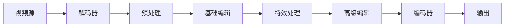
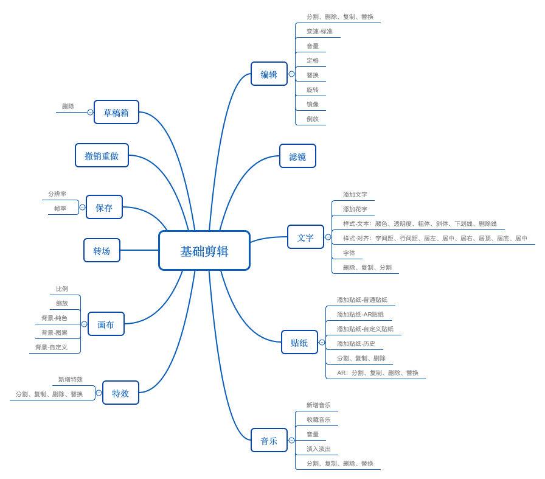

## 背景 & 问题

在移动端视频应用开发中，功能规划和技术实现往往面临以下挑战：
- **功能分散**：各种剪辑功能缺乏统一的架构设计
- **代码复用性低**：相似功能重复实现，维护成本高
- **性能瓶颈**：视频处理算法实现不当导致卡顿
- **开发效率低**：缺乏标准化的开发流程和工具链

本文基于实际项目经验，提供一套完整的视频剪辑应用开发指南。

## 结论先行（TL;DR）

视频剪辑应用的核心是**管道化处理架构 + 模块化功能设计**。通过合理的设计模式和现代技术栈，可以实现高性能、易维护的视频处理应用。

关键要点：
- 🎯 **架构选择**：Command/Handler 模式 + Pipeline 架构
- 🚀 **技术栈**：FFmpeg + OpenGL ES + Camera2D API
- 📱 **性能优化**：异步处理 + 内存池 + 硬件加速
- 🛠️ **代码质量**：模块化 + 单元测试 + 依赖注入

## 原理分析

### 视频处理管道架构

现代视频剪辑应用的核心是**处理管道（Pipeline）**，每个处理阶段都是独立的处理器：



#### 关键组件设计

1. **MediaExtractor（媒体提取器）**
```java
public interface MediaExtractor {
    VideoFrame extractFrame(String videoPath, long timeUs);
    AudioTrack extractAudio(String videoPath);
    MediaMetadata extractMetadata(String videoPath);
}

public class FFmpegMediaExtractor implements MediaExtractor {
    private FFmpeg ffmpeg;
    
    @Override
    public VideoFrame extractFrame(String videoPath, long timeUs) {
        // 使用 FFmpeg 提取指定时间的视频帧
        return ffmpeg.extractFrame(videoPath, timeUs);
    }
    
    @Override
    public AudioTrack extractAudio(String videoPath) {
        // 提取音频轨道
        return ffmpeg.extractAudio(videoPath);
    }
    
    @Override
    public MediaMetadata extractMetadata(String videoPath) {
        // 提取视频元信息
        return ffmpeg.getMetadata(videoPath);
    }
}
```

2. **VideoProcessor（视频处理器）**
```java
public interface VideoProcessor {
    void applyFilter(VideoFrame frame, Filter filter);
    void applyTransition(VideoFrame from, VideoFrame to, Transition transition);
    void adjustSpeed(MediaTrack track, float speed);
    void applyEffect(VideoFrame frame, Effect effect);
}

public class OpenGLVideoProcessor implements VideoProcessor {
    private EGLContext eglContext;
    private ShaderProgram shaderProgram;
    
    @Override
    public void applyFilter(VideoFrame frame, Filter filter) {
        switch (filter.getType()) {
            case COLOR_GRADIENT:
                applyColorGradient(frame, (ColorGradientFilter) filter);
                break;
            case GAUSSIAN_BLUR:
                applyGaussianBlur(frame, (GaussianBlurFilter) filter);
                break;
            // ... 其他滤镜实现
        }
    }
    
    private void applyColorGradient(VideoFrame frame, ColorGradientFilter filter) {
        // 使用 OpenGL ES 着色器实现渐变效果
        bindShader(filter.getShaderSource());
        renderFrameWithFilter(frame, filter.getParameters());
    }
}
```

3. **EffectComposer（特效合成器）**
```java
public class EffectComposer {
    public Composition compose(List<MediaTrack> tracks, CompositionSettings settings) {
        Timeline timeline = new Timeline();
        
        // 添加视频轨道
        for (MediaTrack track : tracks) {
            timeline.addTrack(track);
        }
        
        // 添加转场效果
        if (settings.hasTransitions()) {
            addTransitions(timeline, settings.getTransitions());
        }
        
        // 添加叠加层
        if (settings.hasOverlays()) {
            addOverlays(timeline, settings.getOverlays());
        }
        
        return timeline.render();
    }
}
```

4. **MediaEncoder（媒体编码器）**
```java
public class H264Encoder implements MediaEncoder {
    private MediaCodec mediaCodec;
    private MediaFormat mediaFormat;
    
    public void encodeVideo(VideoFrame[] frames, String outputPath) {
        MediaFormat format = MediaFormat.createVideoFormat(MediaFormat.MIMETYPE_VIDEO_AVC, 
                videoWidth, videoHeight, frameRate, null);
        mediaCodec = MediaCodec.createEncoderByType(format, null);
        
        mediaCodec.configure(format, null, null, 0, 0);
        
        try (FileOutputStream fos = new FileOutputStream(outputPath)) {
            for (VideoFrame frame : frames) {
                mediaCodec.queueInputBuffer(frame.getBuffer());
                ByteBuffer outputBuffer = mediaCodec.getOutputBuffer();
                
                while (mediaCodec.dequeueOutputBuffer(outputBuffer, true) >= 0) {
                    fos.write(outputBuffer.array());
                }
            }
        } finally {
            mediaCodec.stop();
            mediaCodec.release();
        }
    }
}
```

## 实现方案

### 1. 项目架构设计

#### 整体架构
```java
public class VideoEditorApplication extends Application {
    @Override
    public void onCreate() {
        super.onCreate();
        initializeDI();
        initVideoProcessingPipeline();
        initUI();
    }
    
    private void initializeDI() {
        DaggerApplicationComponent.builder()
            .application(this)
            .build()
            .inject(this);
    }
    
    private void initVideoProcessingPipeline() {
        videoProcessingPipeline = videoEditorComponent.getVideoProcessingPipeline();
    }
}
```

#### 依赖注入配置
```java
@Module
public class VideoProcessingModule {
    @Provides
    @Singleton
    public MediaExtractor provideMediaExtractor() {
        return new FFmpegMediaExtractor();
    }
    
    @Provides
    @Singleton
    public VideoProcessor provideVideoProcessor() {
        return new OpenGLVideoProcessor();
    }
    
    @Provides
    @Singleton
    public EffectComposer provideEffectComposer() {
        return new EffectComposer();
    }
    
    @Provides
    @Singleton
    public MediaEncoder provideMediaEncoder() {
        return new H264Encoder();
    }
}
```

### 2. 核心功能实现

#### 高级剪辑功能


**多轨道时间轴编辑**
```java
public class TimelineEditor {
    private List<VideoTrack> tracks = new ArrayList<>();
    private Timeline timeline;
    private Selection selection;
    
    public void addVideoTrack(String videoPath) {
        MediaExtractor extractor = new FFmpegMediaExtractor();
        MediaTrack track = extractor.extractVideoTrack(videoPath);
        tracks.add(track);
        timeline.addTrack(track);
        notifyTimelineChanged();
    }
    
    public void splitTrackAt(VideoTrack track, long timeUs) {
        VideoTrack newTrack = track.splitAt(timeUs);
        tracks.add(tracks.indexOf(track), newTrack);
        timeline.addTrack(newTrack);
        notifyTimelineChanged();
    }
    
    public void applyTransition(Transition transition) {
        if (selection.getDuration() > transition.getDuration()) {
            throw new IllegalArgumentException("Transition longer than selection");
        }
        
        // 自动处理与转场适配的时间轴
        selection.applyTransition(transition);
        notifyTimelineChanged();
    }
}
```


**高级美容功能**
```java
public class BeautyFilterProcessor {
    private GPUImageProcessor gpuProcessor;
    
    public void applyBeautyEffects(VideoFrame frame, BeautySettings settings) {
        // 美白算法
        VideoFrame whitened = applySkinWhitening(frame, settings.getWhiteningLevel());
        
        // 磨皮平滑
        VideoFrame smoothed = applySkinSmoothing(whitened, settings.getSmoothingLevel());
        
        // 大眼效果
        VideoFrame enlarged = applyEyeEnlargement(smoothed, settings.getEyeEnlargementLevel());
        
        // 瘦脸效果
        VideoFrame thinned = applyFaceThinning(enlarged, settings.getThinningLevel());
        
        gpuProcessor.processFrame(thinned);
    }
    
    private VideoFrame applySkinWhitening(VideoFrame frame, float level) {
        // 基于 YUV 颜色空间的皮肤检测和美白算法
        YUVFrame yuvFrame = convertToYUV(frame);
        byte[] whitened = yuvFrame.clone();
        applyWhiteningAlgorithm(whitened, level);
        return convertFromYUV(whitened);
    }
}
```




### 3. 性能优化策略

#### 内存管理
```java
public class VideoFramePool {
    private final Queue<VideoFrame> availableFrames = new LinkedList<>();
    private final int maxPoolSize = 30;
    
    public VideoFrame obtain(int width, int height) {
        synchronized (availableFrames) {
            VideoFrame frame = availableFrames.poll();
            if (frame == null || !isValidSize(frame, width, height)) {
                frame = new VideoFrame(width, height);
            }
            return frame;
        }
    }
    
    public void recycle(VideoFrame frame) {
        synchronized (availableFrames) {
            if (availableFrames.size() < maxPoolSize) {
                availableFrames.offer(frame);
            }
        }
    }
}
```

#### 异步处理
```java
public class AsyncVideoProcessor {
    private ExecutorService executor;
    private Handler mainHandler;
    
    public void processVideoAsync(VideoData data, ProcessCallback callback) {
        executor.submit(() -> {
            try {
                VideoFrame result = processVideoSync(data);
                mainHandler.post(() -> callback.onSuccess(result));
            } catch (Exception e) {
                mainHandler.post(() -> callback.onError(e));
            }
        });
    }
}
```

## 核心代码

### 视频渲染引擎
```java
public class OpenGLRenderer {
    private static final String VERTEX_SHADER = """
        #version 300 es
        precision mediump float;
        layout(location = 0) in vec2 position;
        attribute vec4 a_color;
        varying vec2 v_texCoord;
        uniform sampler2D s_texture;
        
        void main() {
            vec4 color = texture2D(s_texture, v_texCoord);
            gl_FragColor = vec4(color.rgb * color.a, color.a);
        }
    """;
    
    private static final String FRAGMENT_SHADER = """
        precision mediump float;
        varying vec4 v_color;
        
        void main() {
            gl_FragColor = v_color;
        }
    ""`;
    
    public void initShader() {
        int vertexShader = loadShader(GLES20.GL_VERTEX_SHADER, VERTEX_SHADER);
        int fragmentShader = loadShader(GLES20.GL_FRAGMENT_SHADER, FRAGMENT_SHADER);
        
        program = GLES20.glCreateProgram();
        GLES20.glAttachShader(program, vertexShader);
        GLES20.glAttachShader(program, fragmentShader);
        GLES20.glLinkProgram(program);
    }
}
```

### FFmpeg 集成
```java
public class FFmpegBridge {
    static {
        System.loadLibrary("avcodec");
        System.loadLibrary("avformat");
        System.loadLibrary("avutil");
        System.loadLibrary("swresample");
    }
    
    private native void extractVideoFrame(String videoPath, long timeUs, byte[] output);
    
    public native void trimVideo(String inputPath, String outputPath, long startTime, long endTime);
    
    public native void extractAudio(String videoPath, String outputPath);
    
    public native void applyFilter(String inputPath, String filterName, float[] parameters);
}
```

## 常见坑与解决方案

### 1. 内存泄漏

**问题**：异步任务持有 Activity 引用导致内存泄漏

**解决方案**：
```java
public class VideoProcessingTask extends AsyncTask<VideoData, Void, ProcessedData> {
    private WeakReference<Context> contextRef;
    
    public VideoProcessingTask(Context context) {
        contextRef = new WeakReference<>(context);
    }
    
    @Override
    protected ProcessedData doInBackground(VideoData... params) {
        // 使用弱引用避免内存泄漏
        Context context = contextRef.get();
        if (context == null) return null;
        
        return processVideoData(params);
    }
    
    @Override
    protected void onPostExecute(ProcessedData result) {
        Context context = contextRef.get();
        if (context != null) {
            updateUI(result);
        }
    }
}
```

### 2. ANR 错误

**问题**：主线程阻塞导致 ANR

**解决方案**：
```java
public class SafeVideoProcessor {
    public void processVideoOnMainThread(VideoData data, ProcessCallback callback) {
        // 确保在主线程执行
        if (Looper.myLooper() == Looper.getMainLooper()) {
            callback.onSuccess(processVideoSync(data));
        } else {
            new Handler(Looper.getMainLooper()).post(() -> {
                try {
                    callback.onSuccess(processVideoSync(data));
                } catch (Exception e) {
                    callback.onError(e);
                }
            });
        }
    }
}
```

### 3. 编码兼容性

**问题**：不同设备编码器支持性差异

**解决方案**：
```java
public class MediaCodecUtils {
    public static boolean isCodecSupported(String mimeType) {
        if (Build.VERSION.SDK_INT < Build.VERSION_CODES.LOLLIPOP) {
            return false;
        }
        
        MediaCodecList codecs = MediaCodecList.getCodecList();
        for (MediaCodec codec : codecs) {
            if (codec.getName().contains(mimeType)) {
                return true;
            }
        }
        return false;
    }
    
    public static MediaCodec getCompatibleCodec(String mimeType, MediaFormat format) {
        // 获取兼容的编码器
        MediaCodecList codecs = MediaCodecList.getCodecList();
        for (MediaCodec codec : codecs) {
            if (codec.isEncoder()) {
                try {
                    codec.configure(format, null, null, 0);
                    return codec;
                } catch (Exception e) {
                    Log.w(TAG, "Codec configuration failed", e);
                }
            }
        }
        throw new IllegalArgumentException("No compatible codec found");
    }
}
```

### 4. 存储空间不足

**问题**：大文件处理时占用过多存储空间

**解决方案**：
```java
public class StorageManager {
    private static final long CACHE_SIZE = 100 * 1024 * 1024; // 100MB
    
    public void cacheVideoFrame(VideoFrame frame) {
        if (getCacheSize() > CACHE_SIZE) {
            clearOldestCache();
        }
        saveToCache(frame);
    }
    
    public void streamProcessVideo(String videoPath) {
        File tempFile = getTempFile();
        
        // 分块处理，避免内存溢出
        processVideoInChunks(videoPath, tempFile);
        
        // 处理完成后清理临时文件
        tempFile.delete();
    }
}
```

## 可迁移经验

### 1. 技术栈迁移
**从 MediaPlayer 到 ExoPlayer**
- **优势**：更好的性能、更小的体积、硬件解码支持
- **迁移重点**：播放器逻辑、数据源抽象
- **兼容性**：保持旧版本支持的同时引入新特性

### 2. 从 FFmpeg 到 MediaCodec + OpenGL
- **优势**：更好的电池续航、硬件加速、系统集成度
- **迁移重点**：编码逻辑、渲染引擎
- **混合策略**：复杂使用 FFmpeg，简单使用 MediaCodec

### 3. 从同步到异步处理
- **优势**：更好的用户体验、避免 ANR
- **迁移重点**：数据流、状态管理、错误处理
- **设计模式**：观察者模式、命令模式

### 4. 从单线程到多线程
- **优势**：充分利用多核处理器
- **挑战**：线程安全、并发控制
- **解决方案**：线程池、同步机制、不可变对象

## 未来展望

### 1. AI 驱动剪辑
```java
public class AIVideoProcessor {
    private TensorFlowLite model;
    
    public VideoFrame enhanceVideo(VideoFrame frame) {
        // 智能增强：超分辨率、降噪、稳定化
        return aiEnhanceFrame(frame);
    }
    
    private VideoFrame aiEnhanceFrame(VideoFrame frame) {
        // TensorFlow Lite 推理
        TensorBuffer input = preprocessFrame(frame);
        TensorBuffer output = model.run(input);
        return postprocessFrame(frame, output);
    }
}
```

### 2. 实时协作编辑
```java
public class RealtimeVideoEditor {
    private WebSocketServer webSocketServer;
    private SessionManager sessionManager;
    
    public void startCollaborativeEdit(String roomId) {
        sessionManager.createSession(roomId);
        webSocketServer.start();
    }
    
    public void handleRemoteEdit(EditOperation operation) {
        switch (operation.getType()) {
            case ADD_TRACK:
                addTrack(operation.getTrack());
                break;
            case APPLY_FILTER:
                applyFilter(operation.getFilter());
                break;
            case SPLIT_TRACK:
                splitTrack(operation.getTrack(), operation.getTimeUs());
                break;
        }
        broadcastOperation(operation);
    }
}
```

## 总结

视频剪辑应用开发是一个复杂的系统工程，需要综合考虑：
- **架构设计**：模块化、可扩展、易维护
- **性能优化**：异步处理、内存管理、硬件加速
- **用户体验**：响应式设计、流畅交互、错误处理
- **团队协作**：标准化流程、版本控制、持续集成

通过本文介绍的设计模式和实现方案，开发者可以构建出高性能、高质量的移动端视频剪辑应用。记住：**好的架构是成功的基石，持续优化是卓越的关键**。
